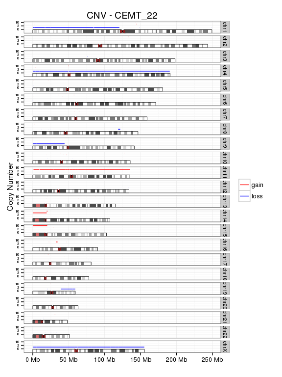

# Glioma - DNA methylation
Gloria Li  
May 26, 2016  

Updated: Thu May 26 18:02:24 2016

## Confirm common mutations in glioma
* Confirmed IDH mutation and 1p19q co-deletion in CEMT19, CEMT22, and CEMT47.     
* IDH mutation frequency in CEMT21 was much lower than expected, and 1p19q deletion was not detected, suggesting tumour content in this sample may be low, estmated 18.5% according to IDH mutattion frequency.   
* Apart from IDH1 mutations and CIC mutation in CEMT47, all other variations in the table were not associated with glioma according to COSMIC. And in the case of CEMT47, those variations were also found in matched blood sample, suggesting they may be germline in other samples as well.    

<table>
 <thead>
  <tr>
   <th style="text-align:right;"> Gene </th>
   <th style="text-align:right;"> CEMT_19 </th>
   <th style="text-align:right;"> CEMT_21 </th>
   <th style="text-align:right;"> CEMT_22 </th>
   <th style="text-align:right;"> CEMT_23 </th>
   <th style="text-align:right;"> CEMT_47 </th>
  </tr>
 </thead>
<tbody>
  <tr>
   <td style="text-align:right;"> Dx/1p19q status </td>
   <td style="text-align:right;"> ODG (1p19q-codel) </td>
   <td style="text-align:right;"> GBMO (1p19q-codel) </td>
   <td style="text-align:right;"> Anaplastic ODG (1p19q-codel) </td>
   <td style="text-align:right;"> GBM </td>
   <td style="text-align:right;"> Anaplastic ODG (1p19q-codel) </td>
  </tr>
  <tr>
   <td style="text-align:right;"> IDH1 R132H IHC </td>
   <td style="text-align:right;"> POSITIVE </td>
   <td style="text-align:right;"> POSITIVE </td>
   <td style="text-align:right;"> POSITIVE </td>
   <td style="text-align:right;"> NEGATIVE </td>
   <td style="text-align:right;"> POSITIVE </td>
  </tr>
  <tr>
   <td style="text-align:right;"> IDH1 </td>
   <td style="text-align:right;"> NON_SYNONYMOUS_CODING(COSM28746) </td>
   <td style="text-align:right;"> N </td>
   <td style="text-align:right;"> NON_SYNONYMOUS_CODING(COSM28746) </td>
   <td style="text-align:right;"> N </td>
   <td style="text-align:right;"> NON_SYNONYMOUS_CODING(COSM28746) </td>
  </tr>
  <tr>
   <td style="text-align:right;"> IDH2 </td>
   <td style="text-align:right;"> N </td>
   <td style="text-align:right;"> N </td>
   <td style="text-align:right;"> N </td>
   <td style="text-align:right;"> N </td>
   <td style="text-align:right;"> N </td>
  </tr>
  <tr>
   <td style="text-align:right;"> FUBP1 </td>
   <td style="text-align:right;"> N </td>
   <td style="text-align:right;"> N </td>
   <td style="text-align:right;"> N </td>
   <td style="text-align:right;"> N </td>
   <td style="text-align:right;"> N </td>
  </tr>
  <tr>
   <td style="text-align:right;"> CIC </td>
   <td style="text-align:right;"> N </td>
   <td style="text-align:right;"> N </td>
   <td style="text-align:right;"> N </td>
   <td style="text-align:right;"> N </td>
   <td style="text-align:right;"> NON_SYNONYMOUS_CODING(COSM132818) </td>
  </tr>
  <tr>
   <td style="text-align:right;"> NOTCH1 </td>
   <td style="text-align:right;"> SYNONYMOUS_CODING(COSM33747) </td>
   <td style="text-align:right;"> SYNONYMOUS_CODING(COSM33747) </td>
   <td style="text-align:right;"> N </td>
   <td style="text-align:right;"> SYNONYMOUS_CODING(COSM33747) </td>
   <td style="text-align:right;"> SYNONYMOUS_CODING(COSM33747) </td>
  </tr>
  <tr>
   <td style="text-align:right;"> TP53 </td>
   <td style="text-align:right;"> N </td>
   <td style="text-align:right;"> N </td>
   <td style="text-align:right;"> N </td>
   <td style="text-align:right;"> NON_SYNONYMOUS_CODING(COSM10779) </td>
   <td style="text-align:right;"> N </td>
  </tr>
  <tr>
   <td style="text-align:right;"> ATRX </td>
   <td style="text-align:right;"> N </td>
   <td style="text-align:right;"> N </td>
   <td style="text-align:right;"> N </td>
   <td style="text-align:right;"> N </td>
   <td style="text-align:right;"> N </td>
  </tr>
  <tr>
   <td style="text-align:right;"> TERT_PROMOTER </td>
   <td style="text-align:right;"> N </td>
   <td style="text-align:right;"> N </td>
   <td style="text-align:right;"> N </td>
   <td style="text-align:right;"> N </td>
   <td style="text-align:right;"> N </td>
  </tr>
  <tr>
   <td style="text-align:right;"> EGFR </td>
   <td style="text-align:right;"> N </td>
   <td style="text-align:right;"> SYNONYMOUS_CODING(COSM42978) </td>
   <td style="text-align:right;"> SYNONYMOUS_CODING(COSM42978) </td>
   <td style="text-align:right;"> SYNONYMOUS_CODING(COSM42978) </td>
   <td style="text-align:right;"> SYNONYMOUS_CODING(COSM42978) </td>
  </tr>
  <tr>
   <td style="text-align:right;"> PTEN </td>
   <td style="text-align:right;"> N </td>
   <td style="text-align:right;"> N </td>
   <td style="text-align:right;"> N </td>
   <td style="text-align:right;"> N </td>
   <td style="text-align:right;"> N </td>
  </tr>
  <tr>
   <td style="text-align:right;"> SETD2 </td>
   <td style="text-align:right;"> NON_SYNONYMOUS_CODING(COSM149375) </td>
   <td style="text-align:right;"> NON_SYNONYMOUS_CODING(COSM149375);NON_SYNONYMOUS_CODING(COSM149378) </td>
   <td style="text-align:right;"> NON_SYNONYMOUS_CODING(COSM149375) </td>
   <td style="text-align:right;"> NON_SYNONYMOUS_CODING(COSM149375) </td>
   <td style="text-align:right;"> NON_SYNONYMOUS_CODING(COSM149375) </td>
  </tr>
  <tr>
   <td style="text-align:right;"> H3F3A </td>
   <td style="text-align:right;"> N </td>
   <td style="text-align:right;"> N </td>
   <td style="text-align:right;"> N </td>
   <td style="text-align:right;"> N </td>
   <td style="text-align:right;"> N </td>
  </tr>
  <tr>
   <td style="text-align:right;"> TET2 </td>
   <td style="text-align:right;"> N </td>
   <td style="text-align:right;"> N </td>
   <td style="text-align:right;"> N </td>
   <td style="text-align:right;"> N </td>
   <td style="text-align:right;"> N </td>
  </tr>
</tbody>
</table>

<table>
<caption>IDH mutation frequency</caption>
 <thead>
  <tr>
   <th style="text-align:right;"> Donor </th>
   <th style="text-align:right;"> Total </th>
   <th style="text-align:right;"> C_wt </th>
   <th style="text-align:right;"> T_mut </th>
  </tr>
 </thead>
<tbody>
  <tr>
   <td style="text-align:right;"> CEMT_19 </td>
   <td style="text-align:right;"> 53 </td>
   <td style="text-align:right;"> 35 </td>
   <td style="text-align:right;"> 18 </td>
  </tr>
  <tr>
   <td style="text-align:right;"> CEMT_21 </td>
   <td style="text-align:right;"> 54 </td>
   <td style="text-align:right;"> 49 </td>
   <td style="text-align:right;"> 5 </td>
  </tr>
  <tr>
   <td style="text-align:right;"> CEMT_22 </td>
   <td style="text-align:right;"> 51 </td>
   <td style="text-align:right;"> 28 </td>
   <td style="text-align:right;"> 23 </td>
  </tr>
  <tr>
   <td style="text-align:right;"> CEMT_23 </td>
   <td style="text-align:right;"> 33 </td>
   <td style="text-align:right;"> 33 </td>
   <td style="text-align:right;"> 0 </td>
  </tr>
  <tr>
   <td style="text-align:right;"> CEMT_47 </td>
   <td style="text-align:right;"> 113 </td>
   <td style="text-align:right;"> 63 </td>
   <td style="text-align:right;"> 50 </td>
  </tr>
</tbody>
</table>

## Copy number variations

