# CB65_MN1ND13 DP vs DN - DNA methylation
Gloria Li  
Nov 30, 2016  

Updated: Mon Dec  5 15:14:01 2016

## CpG coverage QC 
* DN library has lower coverage than the others at CpGs.  
* No. of CpGs with coverage $\ge$ 3:        
	+ DP:   26429266
	+ DN:   24902572
	+ CD34: 27017534

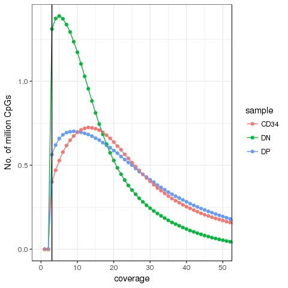<!-- -->

## Global methylation level
* Both DP and DN have higher methylation level than CD34+ cells globally.      
* DP has higher methylation level than DN globally.      

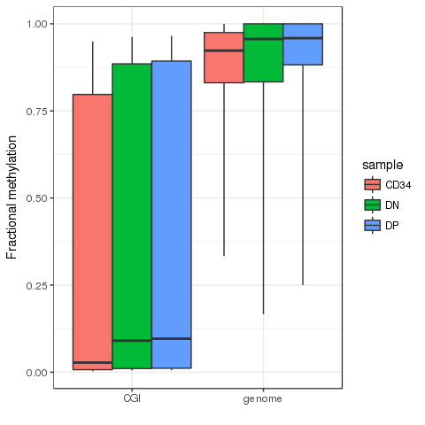<!-- -->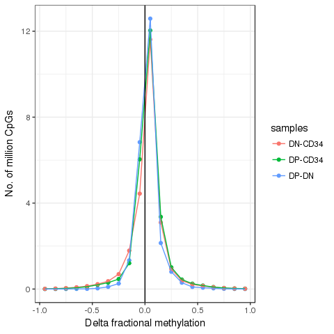<!-- -->

## DMRs 
### Method
* Identify DM CpGs     
	+ methyl_diff p-value < 0.005  
	+ delta fractional methylation > 0.5  
	+ fractional methylation of one sample > 0.6   
* Collapse DM CpGs into DMRs     
	+ adjacent DM CpGs have the same DM status;    
	+ distance between adjacent CpGs (size) < 500bp;   
	+ No. of CpGs within each DMR $\ge$ 3.   

### DMR QC 
* All DMR QC metrics seem within normal range.    
* DMRs between DP and DN are of shorter length, but it can be expected due to the fewer number of DM CpGs.       

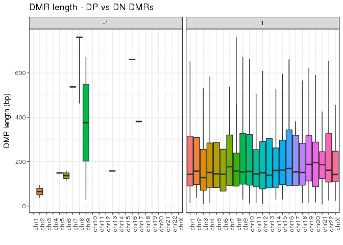<!-- -->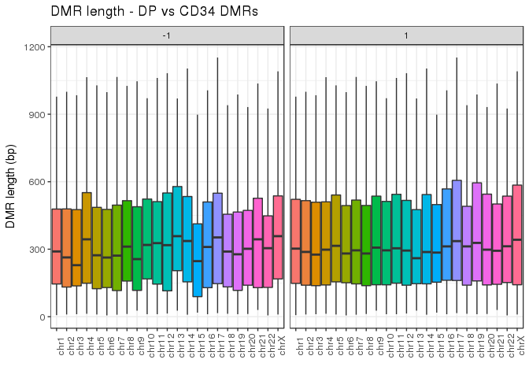<!-- -->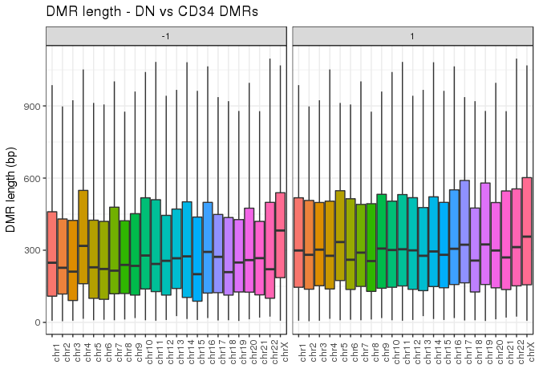<!-- -->

### Summary
* No. of DMRs:

Samples | Hypermethylated | Hypomethylated
------- | --------------- | --------------
DP vs DN | 2317 | 12
DP vs CD34+ | 18028 | 2971
DN vs CD34+ | 14864 | 5009

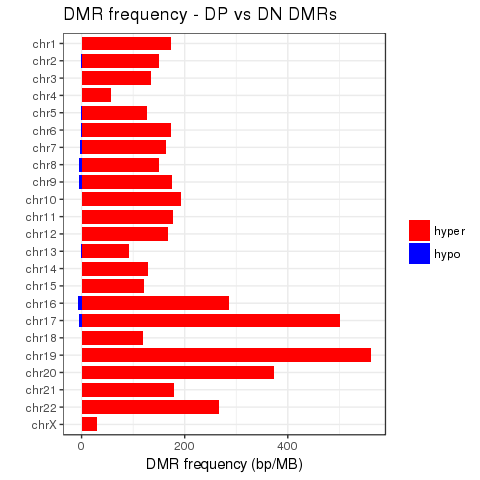<!-- -->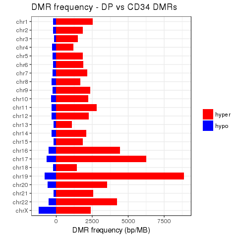<!-- -->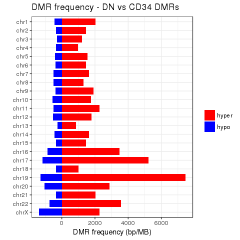<!-- -->

### Enrichment in genomic locations
* DMRs between DP and DN:       
	+ DMRs hypermethylated in DP do not seem to be enriched for any specific genomic locations, but seem to be depleted from CGIs.     
	+ Enrichment for DMRs hypomethylated in DP is not reliable due to small sample size.     
* DMRs between DP/DN and CD34+:       
	+ Both hyper and hypo DMRs are enriched in CGIs, CGI shores, promoters, and exons.         

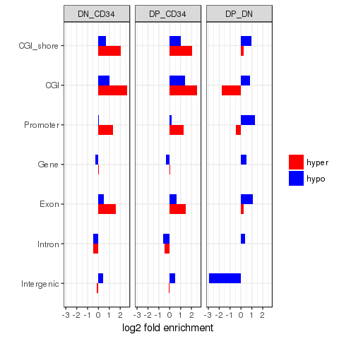<!-- -->

### GREAT functional enrichment analysis
* DMRs between DP and DN:       
	+ DMRs hypermethylated in DP are enriched in immune response.     
* DMRs between DP/DN and CD34+:     
	+ DMRs hypermethylated in DP/DN are enriched in immune system development and cell differentiation.       
	+ DMRs hypomethylated in DP are enriched in cell signaling.      
	+ DMRs hypomethylated in DN are enriched in immunity.    

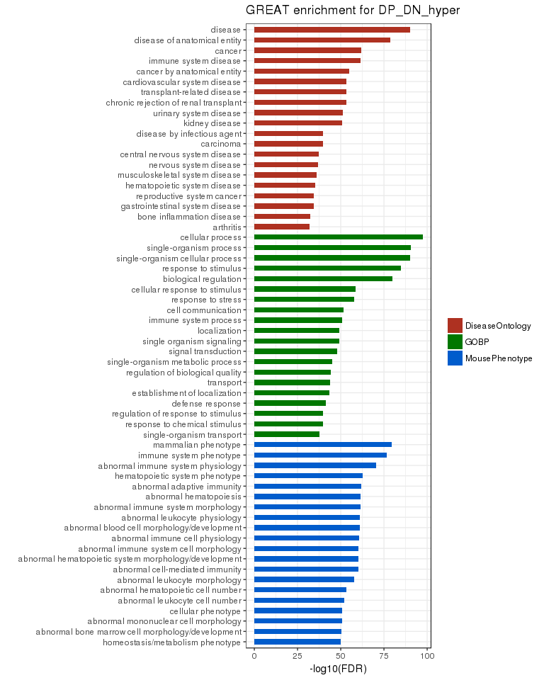<!-- -->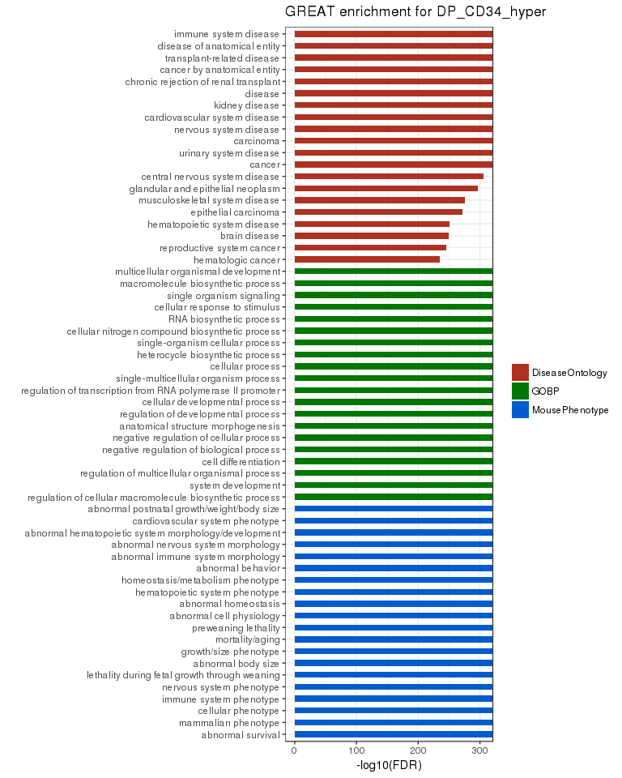<!-- -->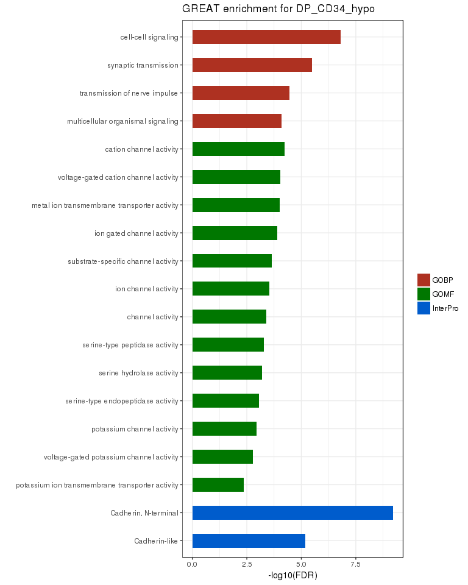<!-- -->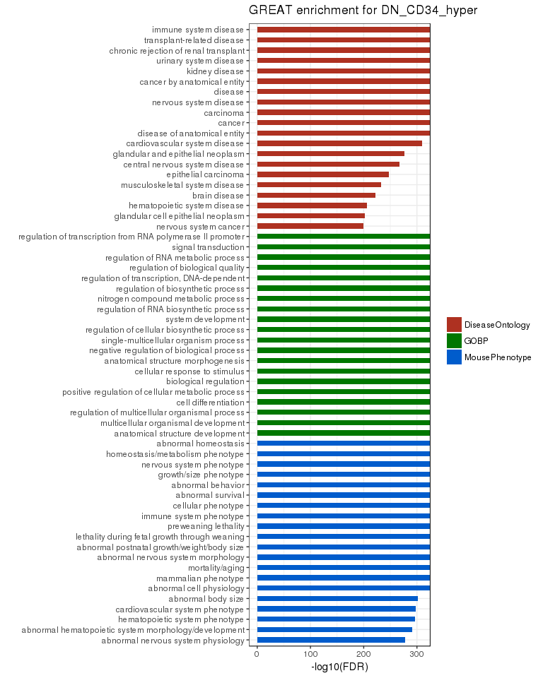<!-- -->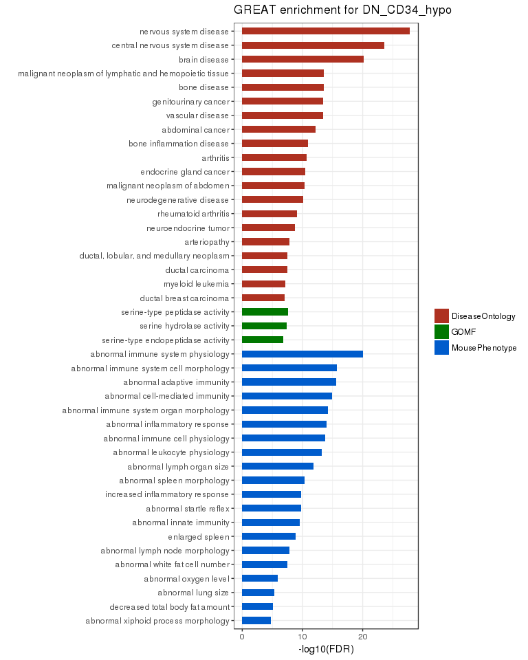<!-- -->

