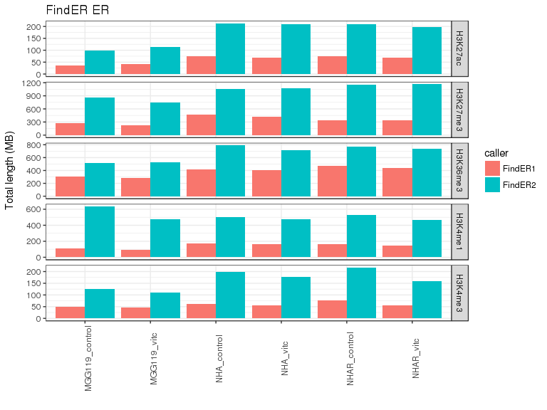

# VitC - ChIPseq
Gloria Li  
Sept 6, 2017  

Updated: Tue Oct 31 13:00:41 2017

## QC  
* Sequencing depth are even across samples, and sufficient (50M for narrow marks, 100M for broad marks).     
* All QC metric looks good.       
* All results suggest that NHAR VitC H3K9me3 sample is actually a H3K4me3 sample, probably due to using the wrong antibody in IP: remove H3K9me3 from further analysis.          

<!-- --><!-- -->

## Enrich regions
* From [UCSC tracks](http://www.bcgsc.ca/downloads/mb/VitC_glioma/HistoneHub/hub.txt), FindER results make more sense than MACS2.      

<!-- -->

## Unique enrich regions
* Unique enrich regions were identified by non-overlapping regions in pairwise comparisons.    

<!-- -->

### VitC reversed histone modification regions
* mut_gain.vitc_loss: regions marked in NHAR but not in NHA overlapped with regions present in NHAR_control but not in NHAR_vitc.     
* mut_loss.vitc_gain: regions marked in NHA but not in NHAR overlapped with regions present in NHAR_vitc but not in NHAR_control.     

#### H3K27ac
* mut_gain.vitc_loss: 7635 regions.     
* mut_loss.vitc_gain: 1670 regions.     

<!-- --><!-- -->
<!-- --><!-- -->
<!-- --><!-- -->
<!-- --><!-- --><table>
 <thead>
  <tr>
   <th style="text-align:left;"> ENSG </th>
   <th style="text-align:left;"> Name </th>
   <th style="text-align:left;"> DE </th>
   <th style="text-align:left;"> Sample </th>
  </tr>
 </thead>
<tbody>
  <tr>
   <td style="text-align:left;"> ENSG00000051108 </td>
   <td style="text-align:left;"> HERPUD1 </td>
   <td style="text-align:left;"> UP </td>
   <td style="text-align:left;"> NHAR_control_NHA_control </td>
  </tr>
  <tr>
   <td style="text-align:left;"> ENSG00000054598 </td>
   <td style="text-align:left;"> FOXC1 </td>
   <td style="text-align:left;"> DN </td>
   <td style="text-align:left;"> NHAR_vitc_NHAR_control </td>
  </tr>
  <tr>
   <td style="text-align:left;"> ENSG00000067798 </td>
   <td style="text-align:left;"> NAV3 </td>
   <td style="text-align:left;"> DN </td>
   <td style="text-align:left;"> NHAR_control_NHA_control </td>
  </tr>
  <tr>
   <td style="text-align:left;"> ENSG00000067798 </td>
   <td style="text-align:left;"> NAV3 </td>
   <td style="text-align:left;"> UP </td>
   <td style="text-align:left;"> NHAR_vitc_NHAR_control </td>
  </tr>
  <tr>
   <td style="text-align:left;"> ENSG00000090530 </td>
   <td style="text-align:left;"> LEPREL1 </td>
   <td style="text-align:left;"> UP </td>
   <td style="text-align:left;"> NHAR_control_NHA_control </td>
  </tr>
  <tr>
   <td style="text-align:left;"> ENSG00000104763 </td>
   <td style="text-align:left;"> ASAH1 </td>
   <td style="text-align:left;"> DN </td>
   <td style="text-align:left;"> NHAR_control_NHA_control </td>
  </tr>
  <tr>
   <td style="text-align:left;"> ENSG00000106477 </td>
   <td style="text-align:left;"> CEP41 </td>
   <td style="text-align:left;"> UP </td>
   <td style="text-align:left;"> NHAR_vitc_NHAR_control </td>
  </tr>
  <tr>
   <td style="text-align:left;"> ENSG00000111110 </td>
   <td style="text-align:left;"> PPM1H </td>
   <td style="text-align:left;"> UP </td>
   <td style="text-align:left;"> NHAR_control_NHA_control </td>
  </tr>
  <tr>
   <td style="text-align:left;"> ENSG00000114480 </td>
   <td style="text-align:left;"> GBE1 </td>
   <td style="text-align:left;"> UP </td>
   <td style="text-align:left;"> NHAR_vitc_NHAR_control </td>
  </tr>
  <tr>
   <td style="text-align:left;"> ENSG00000120129 </td>
   <td style="text-align:left;"> DUSP1 </td>
   <td style="text-align:left;"> DN </td>
   <td style="text-align:left;"> NHAR_vitc_NHAR_control </td>
  </tr>
  <tr>
   <td style="text-align:left;"> ENSG00000123358 </td>
   <td style="text-align:left;"> NR4A1 </td>
   <td style="text-align:left;"> DN </td>
   <td style="text-align:left;"> NHAR_vitc_NHAR_control </td>
  </tr>
  <tr>
   <td style="text-align:left;"> ENSG00000124249 </td>
   <td style="text-align:left;"> KCNK15 </td>
   <td style="text-align:left;"> UP </td>
   <td style="text-align:left;"> NHAR_control_NHA_control </td>
  </tr>
  <tr>
   <td style="text-align:left;"> ENSG00000125611 </td>
   <td style="text-align:left;"> CHCHD5 </td>
   <td style="text-align:left;"> DN </td>
   <td style="text-align:left;"> NHAR_control_NHA_control </td>
  </tr>
  <tr>
   <td style="text-align:left;"> ENSG00000126860 </td>
   <td style="text-align:left;"> EVI2A </td>
   <td style="text-align:left;"> UP </td>
   <td style="text-align:left;"> NHAR_vitc_NHAR_control </td>
  </tr>
  <tr>
   <td style="text-align:left;"> ENSG00000133142 </td>
   <td style="text-align:left;"> TCEAL4 </td>
   <td style="text-align:left;"> UP </td>
   <td style="text-align:left;"> NHAR_vitc_NHAR_control </td>
  </tr>
  <tr>
   <td style="text-align:left;"> ENSG00000133142 </td>
   <td style="text-align:left;"> TCEAL4 </td>
   <td style="text-align:left;"> DN </td>
   <td style="text-align:left;"> NHAR_control_NHA_control </td>
  </tr>
  <tr>
   <td style="text-align:left;"> ENSG00000134853 </td>
   <td style="text-align:left;"> PDGFRA </td>
   <td style="text-align:left;"> UP </td>
   <td style="text-align:left;"> NHAR_control_NHA_control </td>
  </tr>
  <tr>
   <td style="text-align:left;"> ENSG00000135480 </td>
   <td style="text-align:left;"> KRT7 </td>
   <td style="text-align:left;"> UP </td>
   <td style="text-align:left;"> NHAR_control_NHA_control </td>
  </tr>
  <tr>
   <td style="text-align:left;"> ENSG00000137288 </td>
   <td style="text-align:left;"> MNF1 </td>
   <td style="text-align:left;"> UP </td>
   <td style="text-align:left;"> NHAR_vitc_NHAR_control </td>
  </tr>
  <tr>
   <td style="text-align:left;"> ENSG00000137288 </td>
   <td style="text-align:left;"> MNF1 </td>
   <td style="text-align:left;"> DN </td>
   <td style="text-align:left;"> NHAR_control_NHA_control </td>
  </tr>
  <tr>
   <td style="text-align:left;"> ENSG00000139318 </td>
   <td style="text-align:left;"> DUSP6 </td>
   <td style="text-align:left;"> DN </td>
   <td style="text-align:left;"> NHAR_vitc_NHAR_control </td>
  </tr>
  <tr>
   <td style="text-align:left;"> ENSG00000142623 </td>
   <td style="text-align:left;"> PADI1 </td>
   <td style="text-align:left;"> UP </td>
   <td style="text-align:left;"> NHAR_control_NHA_control </td>
  </tr>
  <tr>
   <td style="text-align:left;"> ENSG00000144749 </td>
   <td style="text-align:left;"> LRIG1 </td>
   <td style="text-align:left;"> UP </td>
   <td style="text-align:left;"> NHAR_control_NHA_control </td>
  </tr>
  <tr>
   <td style="text-align:left;"> ENSG00000144749 </td>
   <td style="text-align:left;"> LRIG1 </td>
   <td style="text-align:left;"> DN </td>
   <td style="text-align:left;"> NHAR_vitc_NHAR_control </td>
  </tr>
  <tr>
   <td style="text-align:left;"> ENSG00000144824 </td>
   <td style="text-align:left;"> PHLDB2 </td>
   <td style="text-align:left;"> UP </td>
   <td style="text-align:left;"> NHAR_control_NHA_control </td>
  </tr>
  <tr>
   <td style="text-align:left;"> ENSG00000146592 </td>
   <td style="text-align:left;"> CREB5 </td>
   <td style="text-align:left;"> UP </td>
   <td style="text-align:left;"> NHAR_control_NHA_control </td>
  </tr>
  <tr>
   <td style="text-align:left;"> ENSG00000153714 </td>
   <td style="text-align:left;"> LURAP1L </td>
   <td style="text-align:left;"> UP </td>
   <td style="text-align:left;"> NHAR_vitc_NHAR_control </td>
  </tr>
  <tr>
   <td style="text-align:left;"> ENSG00000159363 </td>
   <td style="text-align:left;"> ATP13A2 </td>
   <td style="text-align:left;"> DN </td>
   <td style="text-align:left;"> NHAR_vitc_NHAR_control </td>
  </tr>
  <tr>
   <td style="text-align:left;"> ENSG00000159363 </td>
   <td style="text-align:left;"> ATP13A2 </td>
   <td style="text-align:left;"> UP </td>
   <td style="text-align:left;"> NHAR_control_NHA_control </td>
  </tr>
  <tr>
   <td style="text-align:left;"> ENSG00000163297 </td>
   <td style="text-align:left;"> ANTXR2 </td>
   <td style="text-align:left;"> DN </td>
   <td style="text-align:left;"> NHAR_control_NHA_control </td>
  </tr>
  <tr>
   <td style="text-align:left;"> ENSG00000164692 </td>
   <td style="text-align:left;"> COL1A2 </td>
   <td style="text-align:left;"> UP </td>
   <td style="text-align:left;"> NHAR_vitc_NHAR_control </td>
  </tr>
  <tr>
   <td style="text-align:left;"> ENSG00000172296 </td>
   <td style="text-align:left;"> SPTLC3 </td>
   <td style="text-align:left;"> UP </td>
   <td style="text-align:left;"> NHAR_vitc_NHAR_control </td>
  </tr>
  <tr>
   <td style="text-align:left;"> ENSG00000172345 </td>
   <td style="text-align:left;"> STARD5 </td>
   <td style="text-align:left;"> UP </td>
   <td style="text-align:left;"> NHAR_control_NHA_control </td>
  </tr>
  <tr>
   <td style="text-align:left;"> ENSG00000175906 </td>
   <td style="text-align:left;"> ARL4D </td>
   <td style="text-align:left;"> DN </td>
   <td style="text-align:left;"> NHAR_control_NHA_control </td>
  </tr>
  <tr>
   <td style="text-align:left;"> ENSG00000181804 </td>
   <td style="text-align:left;"> SLC9A9 </td>
   <td style="text-align:left;"> UP </td>
   <td style="text-align:left;"> NHAR_vitc_NHAR_control </td>
  </tr>
  <tr>
   <td style="text-align:left;"> ENSG00000196507 </td>
   <td style="text-align:left;"> TCEAL3 </td>
   <td style="text-align:left;"> DN </td>
   <td style="text-align:left;"> NHAR_control_NHA_control </td>
  </tr>
  <tr>
   <td style="text-align:left;"> ENSG00000197153 </td>
   <td style="text-align:left;"> HIST1H3J </td>
   <td style="text-align:left;"> UP </td>
   <td style="text-align:left;"> NHAR_vitc_NHAR_control </td>
  </tr>
  <tr>
   <td style="text-align:left;"> ENSG00000197153 </td>
   <td style="text-align:left;"> HIST1H3J </td>
   <td style="text-align:left;"> DN </td>
   <td style="text-align:left;"> NHAR_control_NHA_control </td>
  </tr>
  <tr>
   <td style="text-align:left;"> ENSG00000198339 </td>
   <td style="text-align:left;"> HIST1H4I </td>
   <td style="text-align:left;"> DN </td>
   <td style="text-align:left;"> NHAR_control_NHA_control </td>
  </tr>
  <tr>
   <td style="text-align:left;"> ENSG00000198339 </td>
   <td style="text-align:left;"> HIST1H4I </td>
   <td style="text-align:left;"> UP </td>
   <td style="text-align:left;"> NHAR_vitc_NHAR_control </td>
  </tr>
  <tr>
   <td style="text-align:left;"> ENSG00000198774 </td>
   <td style="text-align:left;"> RASSF9 </td>
   <td style="text-align:left;"> UP </td>
   <td style="text-align:left;"> NHAR_vitc_NHAR_control </td>
  </tr>
  <tr>
   <td style="text-align:left;"> ENSG00000204397 </td>
   <td style="text-align:left;"> CARD16 </td>
   <td style="text-align:left;"> UP </td>
   <td style="text-align:left;"> NHAR_vitc_NHAR_control </td>
  </tr>
  <tr>
   <td style="text-align:left;"> ENSG00000260851 </td>
   <td style="text-align:left;"> RP11-403P17.5 </td>
   <td style="text-align:left;"> UP </td>
   <td style="text-align:left;"> NHAR_control_NHA_control </td>
  </tr>
</tbody>
</table>

<table>
 <thead>
  <tr>
   <th style="text-align:left;"> ENSG </th>
   <th style="text-align:left;"> Name </th>
   <th style="text-align:left;"> DE </th>
   <th style="text-align:left;"> Sample </th>
  </tr>
 </thead>
<tbody>
  <tr>
   <td style="text-align:left;"> ENSG00000022267 </td>
   <td style="text-align:left;"> FHL1 </td>
   <td style="text-align:left;"> UP </td>
   <td style="text-align:left;"> NHAR_control_NHA_control </td>
  </tr>
  <tr>
   <td style="text-align:left;"> ENSG00000051108 </td>
   <td style="text-align:left;"> HERPUD1 </td>
   <td style="text-align:left;"> UP </td>
   <td style="text-align:left;"> NHAR_control_NHA_control </td>
  </tr>
  <tr>
   <td style="text-align:left;"> ENSG00000064205 </td>
   <td style="text-align:left;"> WISP2 </td>
   <td style="text-align:left;"> UP </td>
   <td style="text-align:left;"> NHAR_vitc_NHAR_control </td>
  </tr>
  <tr>
   <td style="text-align:left;"> ENSG00000067798 </td>
   <td style="text-align:left;"> NAV3 </td>
   <td style="text-align:left;"> DN </td>
   <td style="text-align:left;"> NHAR_control_NHA_control </td>
  </tr>
  <tr>
   <td style="text-align:left;"> ENSG00000067798 </td>
   <td style="text-align:left;"> NAV3 </td>
   <td style="text-align:left;"> UP </td>
   <td style="text-align:left;"> NHAR_vitc_NHAR_control </td>
  </tr>
  <tr>
   <td style="text-align:left;"> ENSG00000090530 </td>
   <td style="text-align:left;"> LEPREL1 </td>
   <td style="text-align:left;"> UP </td>
   <td style="text-align:left;"> NHAR_control_NHA_control </td>
  </tr>
  <tr>
   <td style="text-align:left;"> ENSG00000100292 </td>
   <td style="text-align:left;"> HMOX1 </td>
   <td style="text-align:left;"> UP </td>
   <td style="text-align:left;"> NHAR_vitc_NHAR_control </td>
  </tr>
  <tr>
   <td style="text-align:left;"> ENSG00000103876 </td>
   <td style="text-align:left;"> FAH </td>
   <td style="text-align:left;"> UP </td>
   <td style="text-align:left;"> NHAR_vitc_NHAR_control </td>
  </tr>
  <tr>
   <td style="text-align:left;"> ENSG00000105281 </td>
   <td style="text-align:left;"> SLC1A5 </td>
   <td style="text-align:left;"> DN </td>
   <td style="text-align:left;"> NHAR_vitc_NHAR_control </td>
  </tr>
  <tr>
   <td style="text-align:left;"> ENSG00000106477 </td>
   <td style="text-align:left;"> CEP41 </td>
   <td style="text-align:left;"> UP </td>
   <td style="text-align:left;"> NHAR_vitc_NHAR_control </td>
  </tr>
  <tr>
   <td style="text-align:left;"> ENSG00000107201 </td>
   <td style="text-align:left;"> DDX58 </td>
   <td style="text-align:left;"> DN </td>
   <td style="text-align:left;"> NHAR_control_NHA_control </td>
  </tr>
  <tr>
   <td style="text-align:left;"> ENSG00000111110 </td>
   <td style="text-align:left;"> PPM1H </td>
   <td style="text-align:left;"> UP </td>
   <td style="text-align:left;"> NHAR_control_NHA_control </td>
  </tr>
  <tr>
   <td style="text-align:left;"> ENSG00000116285 </td>
   <td style="text-align:left;"> ERRFI1 </td>
   <td style="text-align:left;"> DN </td>
   <td style="text-align:left;"> NHAR_vitc_NHAR_control </td>
  </tr>
  <tr>
   <td style="text-align:left;"> ENSG00000118564 </td>
   <td style="text-align:left;"> FBXL5 </td>
   <td style="text-align:left;"> UP </td>
   <td style="text-align:left;"> NHAR_vitc_NHAR_control </td>
  </tr>
  <tr>
   <td style="text-align:left;"> ENSG00000120129 </td>
   <td style="text-align:left;"> DUSP1 </td>
   <td style="text-align:left;"> DN </td>
   <td style="text-align:left;"> NHAR_vitc_NHAR_control </td>
  </tr>
  <tr>
   <td style="text-align:left;"> ENSG00000123358 </td>
   <td style="text-align:left;"> NR4A1 </td>
   <td style="text-align:left;"> DN </td>
   <td style="text-align:left;"> NHAR_vitc_NHAR_control </td>
  </tr>
  <tr>
   <td style="text-align:left;"> ENSG00000126001 </td>
   <td style="text-align:left;"> CEP250 </td>
   <td style="text-align:left;"> DN </td>
   <td style="text-align:left;"> NHAR_vitc_NHAR_control </td>
  </tr>
  <tr>
   <td style="text-align:left;"> ENSG00000130513 </td>
   <td style="text-align:left;"> GDF15 </td>
   <td style="text-align:left;"> UP </td>
   <td style="text-align:left;"> NHAR_control_NHA_control </td>
  </tr>
  <tr>
   <td style="text-align:left;"> ENSG00000130513 </td>
   <td style="text-align:left;"> GDF15 </td>
   <td style="text-align:left;"> DN </td>
   <td style="text-align:left;"> NHAR_vitc_NHAR_control </td>
  </tr>
  <tr>
   <td style="text-align:left;"> ENSG00000131389 </td>
   <td style="text-align:left;"> SLC6A6 </td>
   <td style="text-align:left;"> UP </td>
   <td style="text-align:left;"> NHAR_control_NHA_control </td>
  </tr>
  <tr>
   <td style="text-align:left;"> ENSG00000133142 </td>
   <td style="text-align:left;"> TCEAL4 </td>
   <td style="text-align:left;"> UP </td>
   <td style="text-align:left;"> NHAR_vitc_NHAR_control </td>
  </tr>
  <tr>
   <td style="text-align:left;"> ENSG00000133142 </td>
   <td style="text-align:left;"> TCEAL4 </td>
   <td style="text-align:left;"> DN </td>
   <td style="text-align:left;"> NHAR_control_NHA_control </td>
  </tr>
  <tr>
   <td style="text-align:left;"> ENSG00000134853 </td>
   <td style="text-align:left;"> PDGFRA </td>
   <td style="text-align:left;"> UP </td>
   <td style="text-align:left;"> NHAR_control_NHA_control </td>
  </tr>
  <tr>
   <td style="text-align:left;"> ENSG00000135480 </td>
   <td style="text-align:left;"> KRT7 </td>
   <td style="text-align:left;"> UP </td>
   <td style="text-align:left;"> NHAR_control_NHA_control </td>
  </tr>
  <tr>
   <td style="text-align:left;"> ENSG00000137642 </td>
   <td style="text-align:left;"> SORL1 </td>
   <td style="text-align:left;"> UP </td>
   <td style="text-align:left;"> NHAR_control_NHA_control </td>
  </tr>
  <tr>
   <td style="text-align:left;"> ENSG00000138316 </td>
   <td style="text-align:left;"> ADAMTS14 </td>
   <td style="text-align:left;"> UP </td>
   <td style="text-align:left;"> NHAR_control_NHA_control </td>
  </tr>
  <tr>
   <td style="text-align:left;"> ENSG00000138623 </td>
   <td style="text-align:left;"> SEMA7A </td>
   <td style="text-align:left;"> DN </td>
   <td style="text-align:left;"> NHAR_control_NHA_control </td>
  </tr>
  <tr>
   <td style="text-align:left;"> ENSG00000139318 </td>
   <td style="text-align:left;"> DUSP6 </td>
   <td style="text-align:left;"> DN </td>
   <td style="text-align:left;"> NHAR_vitc_NHAR_control </td>
  </tr>
  <tr>
   <td style="text-align:left;"> ENSG00000140948 </td>
   <td style="text-align:left;"> ZCCHC14 </td>
   <td style="text-align:left;"> UP </td>
   <td style="text-align:left;"> NHAR_control_NHA_control </td>
  </tr>
  <tr>
   <td style="text-align:left;"> ENSG00000142623 </td>
   <td style="text-align:left;"> PADI1 </td>
   <td style="text-align:left;"> UP </td>
   <td style="text-align:left;"> NHAR_control_NHA_control </td>
  </tr>
  <tr>
   <td style="text-align:left;"> ENSG00000144824 </td>
   <td style="text-align:left;"> PHLDB2 </td>
   <td style="text-align:left;"> UP </td>
   <td style="text-align:left;"> NHAR_control_NHA_control </td>
  </tr>
  <tr>
   <td style="text-align:left;"> ENSG00000146592 </td>
   <td style="text-align:left;"> CREB5 </td>
   <td style="text-align:left;"> UP </td>
   <td style="text-align:left;"> NHAR_control_NHA_control </td>
  </tr>
  <tr>
   <td style="text-align:left;"> ENSG00000153714 </td>
   <td style="text-align:left;"> LURAP1L </td>
   <td style="text-align:left;"> UP </td>
   <td style="text-align:left;"> NHAR_vitc_NHAR_control </td>
  </tr>
  <tr>
   <td style="text-align:left;"> ENSG00000164692 </td>
   <td style="text-align:left;"> COL1A2 </td>
   <td style="text-align:left;"> UP </td>
   <td style="text-align:left;"> NHAR_vitc_NHAR_control </td>
  </tr>
  <tr>
   <td style="text-align:left;"> ENSG00000172301 </td>
   <td style="text-align:left;"> C17orf79 </td>
   <td style="text-align:left;"> DN </td>
   <td style="text-align:left;"> NHAR_control_NHA_control </td>
  </tr>
  <tr>
   <td style="text-align:left;"> ENSG00000172345 </td>
   <td style="text-align:left;"> STARD5 </td>
   <td style="text-align:left;"> UP </td>
   <td style="text-align:left;"> NHAR_control_NHA_control </td>
  </tr>
  <tr>
   <td style="text-align:left;"> ENSG00000181804 </td>
   <td style="text-align:left;"> SLC9A9 </td>
   <td style="text-align:left;"> UP </td>
   <td style="text-align:left;"> NHAR_vitc_NHAR_control </td>
  </tr>
  <tr>
   <td style="text-align:left;"> ENSG00000183011 </td>
   <td style="text-align:left;"> LSMD1 </td>
   <td style="text-align:left;"> DN </td>
   <td style="text-align:left;"> NHAR_control_NHA_control </td>
  </tr>
  <tr>
   <td style="text-align:left;"> ENSG00000183691 </td>
   <td style="text-align:left;"> NOG </td>
   <td style="text-align:left;"> DN </td>
   <td style="text-align:left;"> NHAR_vitc_NHAR_control </td>
  </tr>
  <tr>
   <td style="text-align:left;"> ENSG00000183691 </td>
   <td style="text-align:left;"> NOG </td>
   <td style="text-align:left;"> UP </td>
   <td style="text-align:left;"> NHAR_control_NHA_control </td>
  </tr>
  <tr>
   <td style="text-align:left;"> ENSG00000184178 </td>
   <td style="text-align:left;"> SCFD2 </td>
   <td style="text-align:left;"> UP </td>
   <td style="text-align:left;"> NHAR_vitc_NHAR_control </td>
  </tr>
  <tr>
   <td style="text-align:left;"> ENSG00000184678 </td>
   <td style="text-align:left;"> HIST2H2BE </td>
   <td style="text-align:left;"> DN </td>
   <td style="text-align:left;"> NHAR_control_NHA_control </td>
  </tr>
  <tr>
   <td style="text-align:left;"> ENSG00000184678 </td>
   <td style="text-align:left;"> HIST2H2BE </td>
   <td style="text-align:left;"> UP </td>
   <td style="text-align:left;"> NHAR_vitc_NHAR_control </td>
  </tr>
  <tr>
   <td style="text-align:left;"> ENSG00000186577 </td>
   <td style="text-align:left;"> C6orf1 </td>
   <td style="text-align:left;"> DN </td>
   <td style="text-align:left;"> NHAR_control_NHA_control </td>
  </tr>
  <tr>
   <td style="text-align:left;"> ENSG00000196374 </td>
   <td style="text-align:left;"> HIST1H2BM </td>
   <td style="text-align:left;"> DN </td>
   <td style="text-align:left;"> NHAR_control_NHA_control </td>
  </tr>
  <tr>
   <td style="text-align:left;"> ENSG00000196374 </td>
   <td style="text-align:left;"> HIST1H2BM </td>
   <td style="text-align:left;"> UP </td>
   <td style="text-align:left;"> NHAR_vitc_NHAR_control </td>
  </tr>
  <tr>
   <td style="text-align:left;"> ENSG00000197467 </td>
   <td style="text-align:left;"> COL13A1 </td>
   <td style="text-align:left;"> DN </td>
   <td style="text-align:left;"> NHAR_control_NHA_control </td>
  </tr>
  <tr>
   <td style="text-align:left;"> ENSG00000198339 </td>
   <td style="text-align:left;"> HIST1H4I </td>
   <td style="text-align:left;"> DN </td>
   <td style="text-align:left;"> NHAR_control_NHA_control </td>
  </tr>
  <tr>
   <td style="text-align:left;"> ENSG00000198339 </td>
   <td style="text-align:left;"> HIST1H4I </td>
   <td style="text-align:left;"> UP </td>
   <td style="text-align:left;"> NHAR_vitc_NHAR_control </td>
  </tr>
  <tr>
   <td style="text-align:left;"> ENSG00000198774 </td>
   <td style="text-align:left;"> RASSF9 </td>
   <td style="text-align:left;"> UP </td>
   <td style="text-align:left;"> NHAR_vitc_NHAR_control </td>
  </tr>
  <tr>
   <td style="text-align:left;"> ENSG00000198830 </td>
   <td style="text-align:left;"> HMGN2 </td>
   <td style="text-align:left;"> DN </td>
   <td style="text-align:left;"> NHAR_control_NHA_control </td>
  </tr>
  <tr>
   <td style="text-align:left;"> ENSG00000204397 </td>
   <td style="text-align:left;"> CARD16 </td>
   <td style="text-align:left;"> UP </td>
   <td style="text-align:left;"> NHAR_vitc_NHAR_control </td>
  </tr>
  <tr>
   <td style="text-align:left;"> ENSG00000228768 </td>
   <td style="text-align:left;"> AC003101.1 </td>
   <td style="text-align:left;"> DN </td>
   <td style="text-align:left;"> NHAR_vitc_NHAR_control </td>
  </tr>
  <tr>
   <td style="text-align:left;"> ENSG00000242265 </td>
   <td style="text-align:left;"> PEG10 </td>
   <td style="text-align:left;"> UP </td>
   <td style="text-align:left;"> NHAR_control_NHA_control </td>
  </tr>
  <tr>
   <td style="text-align:left;"> ENSG00000258832 </td>
   <td style="text-align:left;"> KRT86 </td>
   <td style="text-align:left;"> UP </td>
   <td style="text-align:left;"> NHAR_control_NHA_control </td>
  </tr>
</tbody>
</table>

#### H3K4me1
* mut_gain.vitc_loss: 25023 regions.     
* mut_loss.vitc_gain: 9794 regions.     

<!-- --><!-- -->
<!-- --><!-- -->

#### H3K4me3
* mut_gain.vitc_loss: 14389 regions.     
* mut_loss.vitc_gain: 835 regions.     

<!-- --><!-- -->
<!-- --><!-- -->

#### H3K27me3
* mut_gain.vitc_loss: 94072 regions.     
* mut_loss.vitc_gain: 52580 regions.     

<!-- --><!-- -->

#### H3K36me3
* mut_gain.vitc_loss: 66947 regions.     
* mut_loss.vitc_gain: 21870 regions.     

<!-- --><!-- -->
