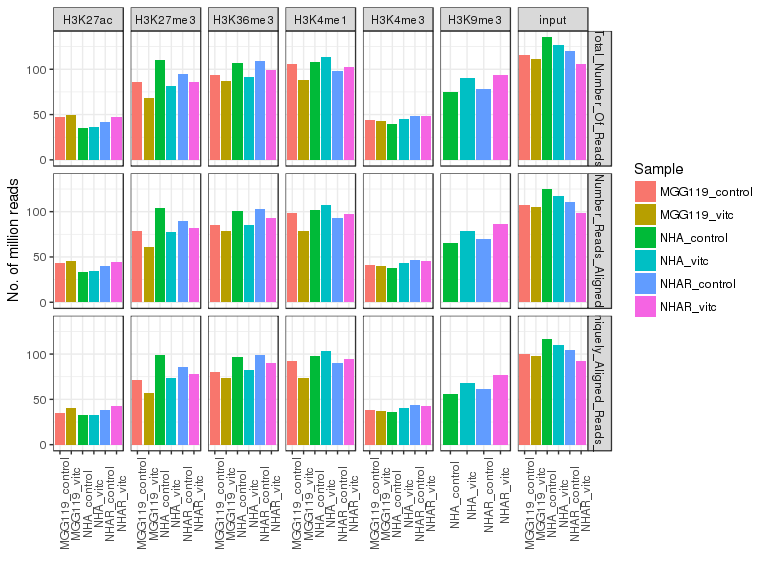
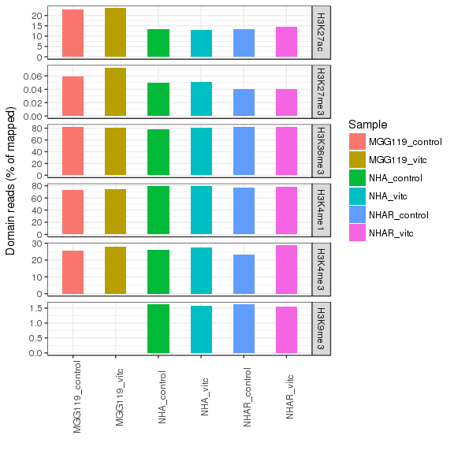

# VitC - ChIPseq
Gloria Li  
Sept 6, 2017  

Updated: Wed Sep  6 12:05:30 2017


## QC  
* Sequencing depth are even across samples, and sufficient (50M for narrow marks, 100M for broad marks).     
* All QC metric looks good.       

<!-- --><!-- --><!-- -->

## Enrich regions
* H3K9me3 NHAR VitC sample has much lower genome coverage than any other H3K9me3 samples.       
* From [UCSC tracks](http://www.bcgsc.ca/downloads/mb/VitC_glioma/HistoneHub/hub.txt), FindER results make more sense than MACS2.      

<!-- --><!-- -->

## H3K9me3 NHAR VitC
* All results suggest that NHAR VitC H3K9me3 sample is actually a H3K4me3 sample, probably due to using the wrong antibody in IP.      
* NHAR VitC H3K9me3 sample is a technical replicate of NHAR VitC H3K4me3 sample with twice sequencing depth.    

<!-- -->

```
## (polygon[GRID.polygon.1940], polygon[GRID.polygon.1941], polygon[GRID.polygon.1942], polygon[GRID.polygon.1943], text[GRID.text.1944], text[GRID.text.1945], lines[GRID.lines.1946], text[GRID.text.1947], text[GRID.text.1948], text[GRID.text.1949])
```

<!-- -->


<!-- -->

```
## (polygon[GRID.polygon.1995], polygon[GRID.polygon.1996], polygon[GRID.polygon.1997], polygon[GRID.polygon.1998], text[GRID.text.1999], text[GRID.text.2000], lines[GRID.lines.2001], text[GRID.text.2002], text[GRID.text.2003], text[GRID.text.2004])
```

<!-- -->

