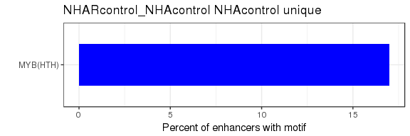
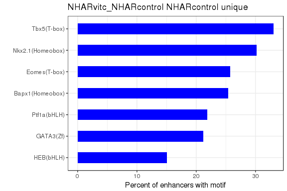

# VitC - ChIPseq
Gloria Li  
Sept 6, 2017  

Updated: Mon Oct 16 10:49:27 2017

## QC  
* Sequencing depth are even across samples, and sufficient (50M for narrow marks, 100M for broad marks).     
* All QC metric looks good.       
* All results suggest that NHAR VitC H3K9me3 sample is actually a H3K4me3 sample, probably due to using the wrong antibody in IP: remove H3K9me3 from further analysis.          

<!-- --><!-- --><!-- -->

## Enrich regions
* From [UCSC tracks](http://www.bcgsc.ca/downloads/mb/VitC_glioma/HistoneHub/hub.txt), FindER results make more sense than MACS2.      

<!-- -->

## Unique enrich regions
* Unique enrich regions were identified by non-overlapping regions in pairwise comparisons.    

<!-- -->

### Homer for unique H3K27ac 
* Results correlate those in CEMT glioma.    

<!-- -->
<!-- -->
<!-- -->
<!-- -->

