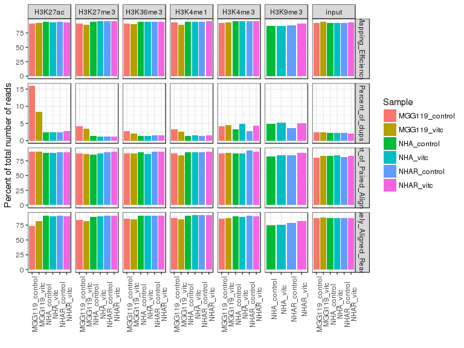
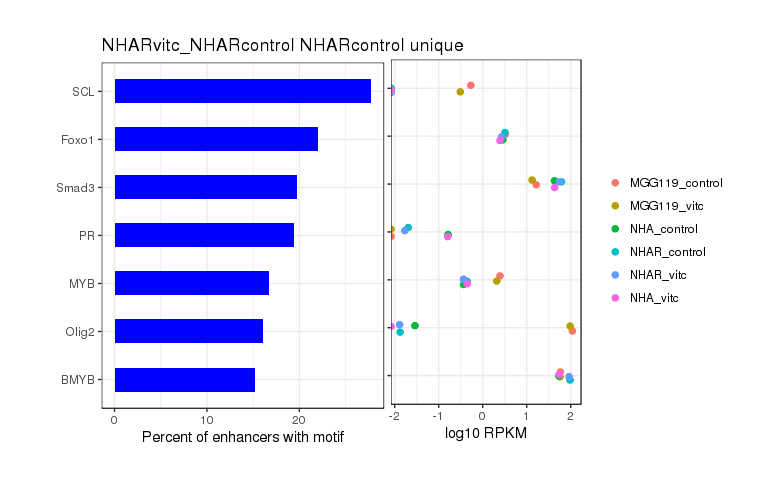
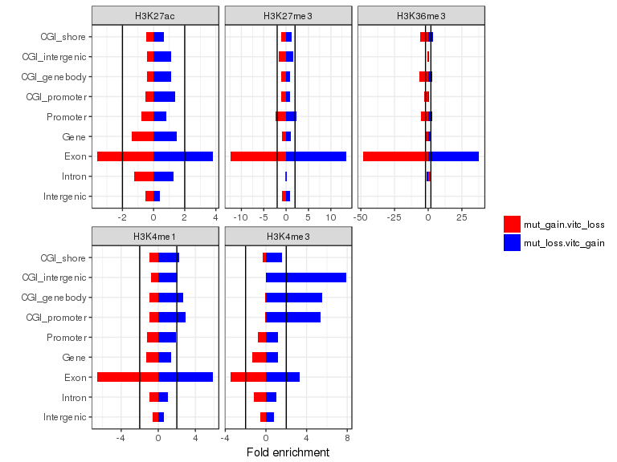
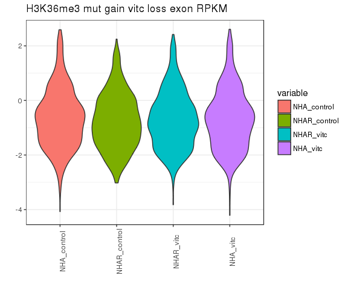

# VitC - ChIPseq
Gloria Li  
Sept 6, 2017  

Updated: Mon Apr 30 12:40:33 2018

## QC  
* Sequencing depth are even across samples, and sufficient (50M for narrow marks, 100M for broad marks).     
* All QC metric looks good.       
* All results suggest that NHAR VitC H3K9me3 sample is actually a H3K4me3 sample, probably due to using the wrong antibody in IP: remove H3K9me3 from further analysis.          

<!-- --><!-- -->

## Enrich regions
* From [UCSC tracks](http://www.bcgsc.ca/downloads/mb/VitC_glioma/HistoneHub/hub.txt), FindER results make more sense than MACS2.      
* FindER2 results showed much more ERs in addition to FindER ERs. Most of the additional ERs seems real from UCSC tracks.        

<!-- -->

## Unique enrich regions

<!-- -->

### H3K27ac homer

<!-- --><!-- --><!-- --><!-- --><!-- --><!-- -->

### VitC reversed histone modification regions
* mut_gain.vitc_loss: regions marked in NHAR but not in NHA overlapped with regions present in NHAR_control but not in NHAR_vitc.     
* mut_loss.vitc_gain: regions marked in NHA but not in NHAR overlapped with regions present in NHAR_vitc but not in NHAR_control.     

<!-- -->

#### H3K27ac
* mut_gain.vitc_loss: 29482 regions.     
* mut_loss.vitc_gain: 7099 regions.     

<!-- --><!-- -->
<!-- -->
<!-- -->
<!-- -->

#### H3K4me1
* mut_gain.vitc_loss: 175773 regions.     
* mut_loss.vitc_gain: 94757 regions.     

<!-- --><!-- -->
<!-- --><!-- -->

#### H3K4me3
* mut_gain.vitc_loss: 27606 regions.     
* mut_loss.vitc_gain: 3892 regions.     

<!-- --><!-- -->

#### H3K27me3
* mut_gain.vitc_loss: 338258 regions.     
* mut_loss.vitc_gain: 280807 regions.     

<!-- --><!-- -->
<!-- --><!-- -->
<!-- --><!-- -->

#### H3K36me3
* mut_gain.vitc_loss: 183643 regions.     
* mut_loss.vitc_gain: 177902 regions.     

<!-- --><!-- -->
<!-- -->
<!-- -->
