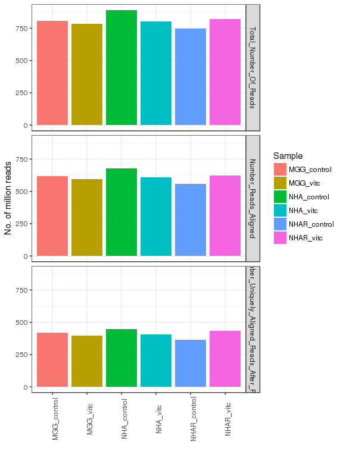
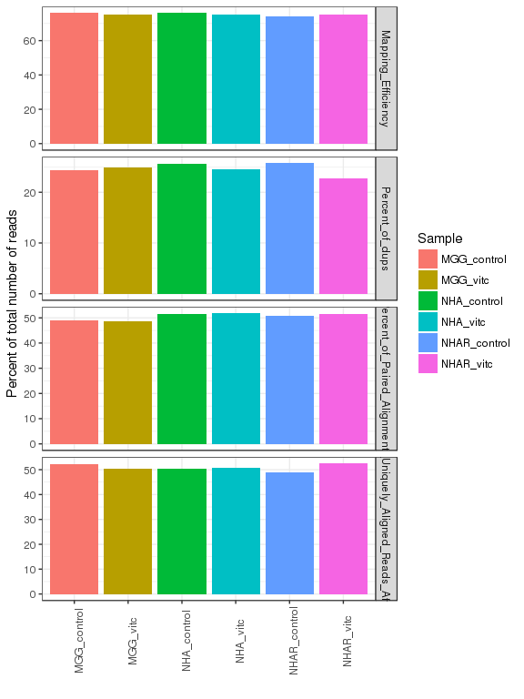
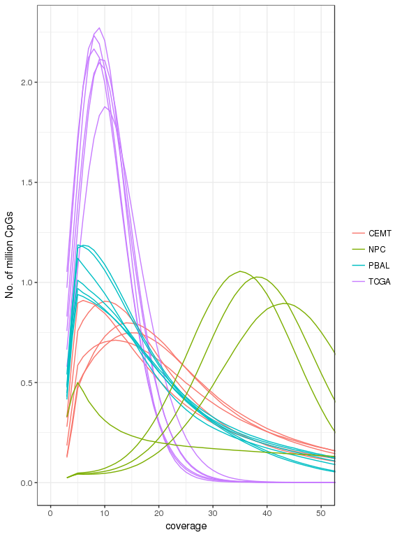
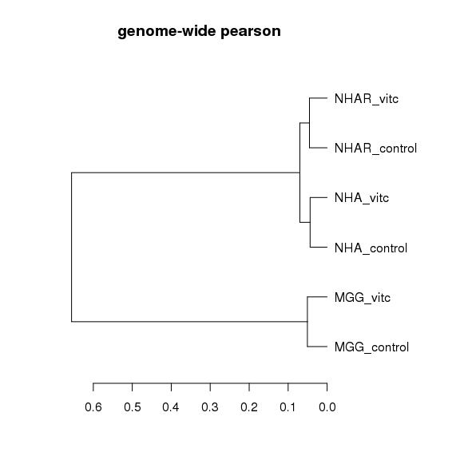
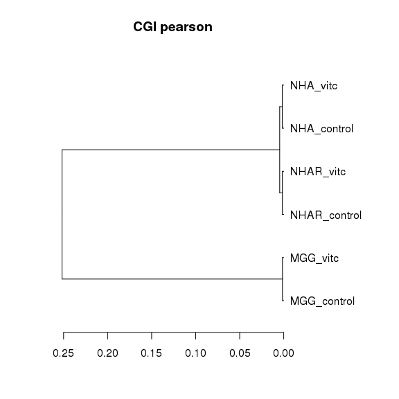
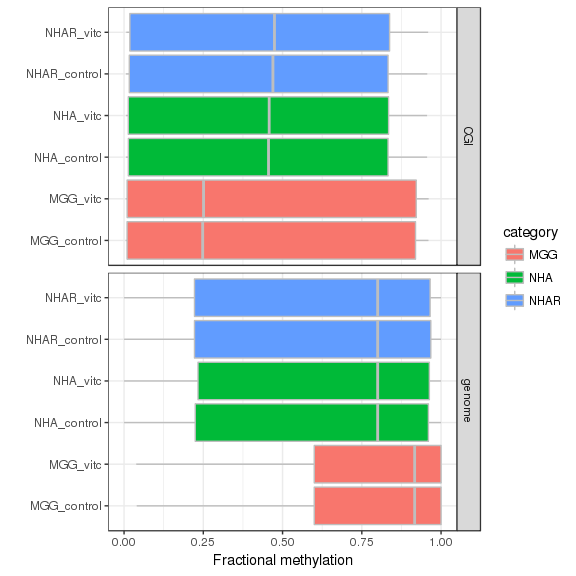
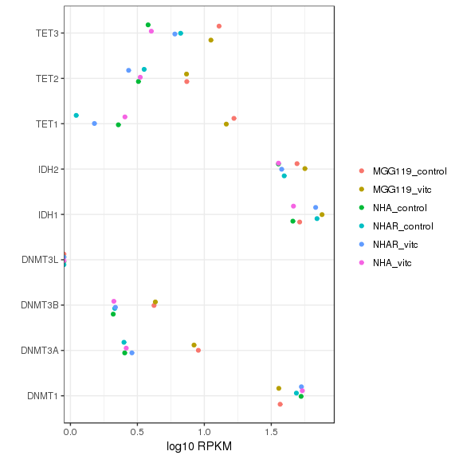
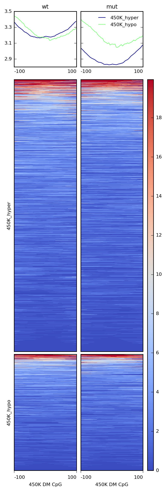
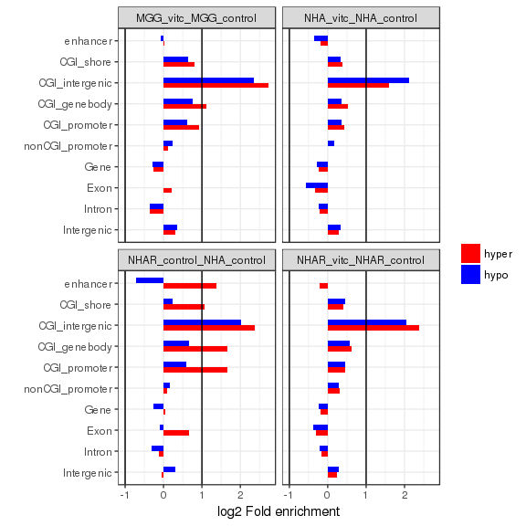

# VitC - PBAL
Gloria Li  
Feb 18, 2018  

Updated: Mon Mar 19 07:06:34 2018

## QC
* Duplicate rate are higher than expected.      
* Coverage at CpG sites are lower than other libraries.     

<!-- --><!-- --><!-- -->

## Clustering
* Very high correlation between samples within the same cell lines.    

<!-- --><!-- -->

## 5mC distribution
* No CIMP phenotype in NHAR samples, even though IDH mutant were expressed.   

<!-- -->

### Why no CIMP in NHAR? 
* Hypothesis 1: IDH1 mutation unsuccefully induced -> NO     

<table>
 <thead>
  <tr>
   <th style="text-align:left;"> Sample </th>
   <th style="text-align:left;"> Assay </th>
   <th style="text-align:left;"> T </th>
   <th style="text-align:left;"> C </th>
   <th style="text-align:left;"> rate </th>
  </tr>
 </thead>
<tbody>
  <tr>
   <td style="text-align:left;"> MGG119_control </td>
   <td style="text-align:left;"> RNAseq </td>
   <td style="text-align:left;"> 74 </td>
   <td style="text-align:left;"> 64 </td>
   <td style="text-align:left;"> 0.5362320 </td>
  </tr>
  <tr>
   <td style="text-align:left;"> MGG119_vitc </td>
   <td style="text-align:left;"> RNAseq </td>
   <td style="text-align:left;"> 108 </td>
   <td style="text-align:left;"> 106 </td>
   <td style="text-align:left;"> 0.5046730 </td>
  </tr>
  <tr>
   <td style="text-align:left;"> NHA_control </td>
   <td style="text-align:left;"> RNAseq </td>
   <td style="text-align:left;"> 3 </td>
   <td style="text-align:left;"> 402 </td>
   <td style="text-align:left;"> 0.0074074 </td>
  </tr>
  <tr>
   <td style="text-align:left;"> NHAR_control </td>
   <td style="text-align:left;"> RNAseq </td>
   <td style="text-align:left;"> 518 </td>
   <td style="text-align:left;"> 328 </td>
   <td style="text-align:left;"> 0.6122930 </td>
  </tr>
  <tr>
   <td style="text-align:left;"> NHAR_vitc </td>
   <td style="text-align:left;"> RNAseq </td>
   <td style="text-align:left;"> 353 </td>
   <td style="text-align:left;"> 405 </td>
   <td style="text-align:left;"> 0.4656990 </td>
  </tr>
  <tr>
   <td style="text-align:left;"> NHA_vitc </td>
   <td style="text-align:left;"> RNAseq </td>
   <td style="text-align:left;"> 0 </td>
   <td style="text-align:left;"> 523 </td>
   <td style="text-align:left;"> 0.0000000 </td>
  </tr>
</tbody>
</table>

* Hypotheis 2: abnormal expression of DNA methylation modifiers -> NO      

<!-- -->

* Hypothesis 3: TET mutation resulting in insensitive to 2HG -> Not likely       
	+ The only non-neutral variance in TETs identified in NHA lines is TET1 K1019E. It is outside TET1's 2HG, metal or DNA-binding domains, and is never annotated in cancer before.        
	+ 5hmC changes still occured as expected, suggessting TET is functioning.      

* Hypothesis 4: cells blocked at hmC, and can not transition to a CpG state -> not enough evidence        
	+ There are more regions lose 5hmC than gain from wt to mut, with no change in PBAL.      
	+ However, no evidence of 5hmC was found around hyper CpGs (+/- 100bp) identified in the Nature Genetics paper.    

<table>
 <thead>
  <tr>
   <th style="text-align:right;"> Comparison </th>
   <th style="text-align:right;"> PBAL </th>
   <th style="text-align:right;"> hMeDIP </th>
   <th style="text-align:right;"> N_region </th>
   <th style="text-align:right;"> length </th>
  </tr>
 </thead>
<tbody>
  <tr>
   <td style="text-align:right;"> wt-mut </td>
   <td style="text-align:right;"> ST </td>
   <td style="text-align:right;"> hyper </td>
   <td style="text-align:right;"> 228121 </td>
   <td style="text-align:right;"> 456242 </td>
  </tr>
  <tr>
   <td style="text-align:right;"> wt-mut </td>
   <td style="text-align:right;"> ST </td>
   <td style="text-align:right;"> hypo </td>
   <td style="text-align:right;"> 506180 </td>
   <td style="text-align:right;"> 1012360 </td>
  </tr>
</tbody>
</table>

      

* Hypotheis 5: CNVs (from PBAL -> depth too low)     
	+ MGG119     
   

	+ NHA       
   

	+ NHAR      
   

## DMRs
### Methods
* DM CpGs      
	+ Methyl_diff p-value < 0.1       
	+ delta 5mC > 0.25       
	+ hyper 5mC > 0.5     
* DMR dynamic growth     
	+ distance to adjacent DM CpG < 500bp      
	+ No. of CpGs > 3       

### Summary

<table>
 <thead>
  <tr>
   <th style="text-align:left;"> Sample1 </th>
   <th style="text-align:left;"> Sample2 </th>
   <th style="text-align:left;"> DM </th>
   <th style="text-align:left;"> N_region </th>
   <th style="text-align:left;"> length </th>
  </tr>
 </thead>
<tbody>
  <tr>
   <td style="text-align:left;"> MGG_vitc </td>
   <td style="text-align:left;"> MGG_control </td>
   <td style="text-align:left;"> hyper </td>
   <td style="text-align:left;"> 6449 </td>
   <td style="text-align:left;"> 2019824 </td>
  </tr>
  <tr>
   <td style="text-align:left;"> MGG_vitc </td>
   <td style="text-align:left;"> MGG_control </td>
   <td style="text-align:left;"> hypo </td>
   <td style="text-align:left;"> 6584 </td>
   <td style="text-align:left;"> 2099221 </td>
  </tr>
  <tr>
   <td style="text-align:left;"> NHA_vitc </td>
   <td style="text-align:left;"> NHA_control </td>
   <td style="text-align:left;"> hyper </td>
   <td style="text-align:left;"> 8516 </td>
   <td style="text-align:left;"> 2419914 </td>
  </tr>
  <tr>
   <td style="text-align:left;"> NHA_vitc </td>
   <td style="text-align:left;"> NHA_control </td>
   <td style="text-align:left;"> hypo </td>
   <td style="text-align:left;"> 8093 </td>
   <td style="text-align:left;"> 2225292 </td>
  </tr>
  <tr>
   <td style="text-align:left;"> NHAR_control </td>
   <td style="text-align:left;"> NHA_control </td>
   <td style="text-align:left;"> hyper </td>
   <td style="text-align:left;"> 25801 </td>
   <td style="text-align:left;"> 8538731 </td>
  </tr>
  <tr>
   <td style="text-align:left;"> NHAR_control </td>
   <td style="text-align:left;"> NHA_control </td>
   <td style="text-align:left;"> hypo </td>
   <td style="text-align:left;"> 25549 </td>
   <td style="text-align:left;"> 9976772 </td>
  </tr>
  <tr>
   <td style="text-align:left;"> NHAR_vitc </td>
   <td style="text-align:left;"> NHAR_control </td>
   <td style="text-align:left;"> hyper </td>
   <td style="text-align:left;"> 9754 </td>
   <td style="text-align:left;"> 2841512 </td>
  </tr>
  <tr>
   <td style="text-align:left;"> NHAR_vitc </td>
   <td style="text-align:left;"> NHAR_control </td>
   <td style="text-align:left;"> hypo </td>
   <td style="text-align:left;"> 7526 </td>
   <td style="text-align:left;"> 2066921 </td>
  </tr>
</tbody>
</table>

* Remove differentially 5hmC regions from DMRs    

<table>
 <thead>
  <tr>
   <th style="text-align:left;"> Sample1 </th>
   <th style="text-align:left;"> Sample2 </th>
   <th style="text-align:left;"> DM </th>
   <th style="text-align:left;"> N_region </th>
   <th style="text-align:left;"> length </th>
  </tr>
 </thead>
<tbody>
  <tr>
   <td style="text-align:left;"> MGG_vitc </td>
   <td style="text-align:left;"> MGG_control </td>
   <td style="text-align:left;"> hyper </td>
   <td style="text-align:left;"> 6322 </td>
   <td style="text-align:left;"> 1968531 </td>
  </tr>
  <tr>
   <td style="text-align:left;"> MGG_vitc </td>
   <td style="text-align:left;"> MGG_control </td>
   <td style="text-align:left;"> hypo </td>
   <td style="text-align:left;"> 6579 </td>
   <td style="text-align:left;"> 2096873 </td>
  </tr>
  <tr>
   <td style="text-align:left;"> NHA_vitc </td>
   <td style="text-align:left;"> NHA_control </td>
   <td style="text-align:left;"> hyper </td>
   <td style="text-align:left;"> 8506 </td>
   <td style="text-align:left;"> 2415721 </td>
  </tr>
  <tr>
   <td style="text-align:left;"> NHA_vitc </td>
   <td style="text-align:left;"> NHA_control </td>
   <td style="text-align:left;"> hypo </td>
   <td style="text-align:left;"> 8086 </td>
   <td style="text-align:left;"> 2222927 </td>
  </tr>
  <tr>
   <td style="text-align:left;"> NHAR_control </td>
   <td style="text-align:left;"> NHA_control </td>
   <td style="text-align:left;"> hyper </td>
   <td style="text-align:left;"> 25768 </td>
   <td style="text-align:left;"> 8522551 </td>
  </tr>
  <tr>
   <td style="text-align:left;"> NHAR_control </td>
   <td style="text-align:left;"> NHA_control </td>
   <td style="text-align:left;"> hypo </td>
   <td style="text-align:left;"> 25472 </td>
   <td style="text-align:left;"> 9935689 </td>
  </tr>
  <tr>
   <td style="text-align:left;"> NHAR_vitc </td>
   <td style="text-align:left;"> NHAR_control </td>
   <td style="text-align:left;"> hyper </td>
   <td style="text-align:left;"> 9728 </td>
   <td style="text-align:left;"> 2832852 </td>
  </tr>
  <tr>
   <td style="text-align:left;"> NHAR_vitc </td>
   <td style="text-align:left;"> NHAR_control </td>
   <td style="text-align:left;"> hypo </td>
   <td style="text-align:left;"> 7518 </td>
   <td style="text-align:left;"> 2063261 </td>
  </tr>
</tbody>
</table>

### Enrichment in genomic regions 

<!-- -->

