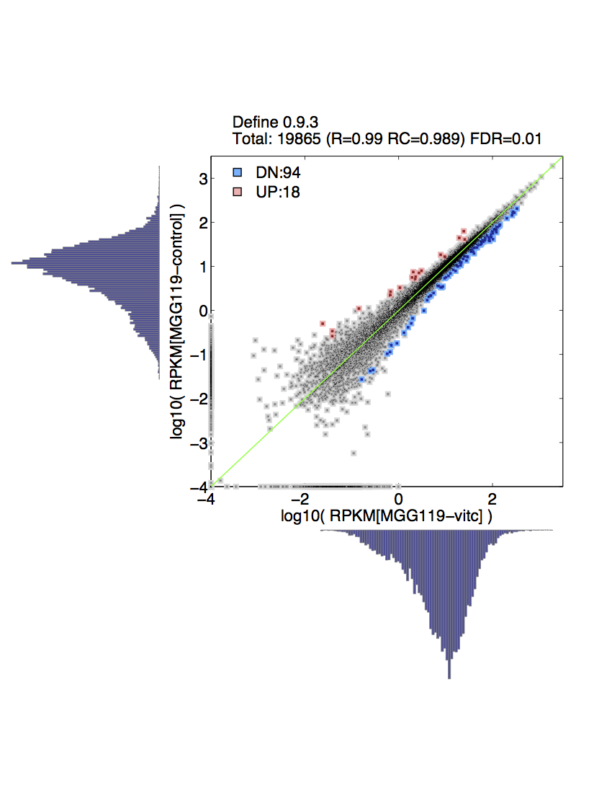

Updated: `r date()`

```{r setup, include = FALSE, eval=F}
library(ggplot2)
library(plyr)
library(VennDiagram)
library(gridExtra)
library(gplots)
library(dendextend)
library(reshape)
library(wq)
library(dplyr)
library(RCircos)
library(knitr)
load("/projects/epigenomics3/epigenomics3_results/users/lli/NHA/RNAseq/RNAseq.Rdata")
knitr::opts_chunk$set(message=FALSE, echo = FALSE, warning = FALSE, results = FALSE, fig.height = 6, fig.width = 6) 
knitr::opts_knit$set(root.dir = "/projects/epigenomics3/epigenomics3_results/users/lli/NHA/RNAseq/")
```

## Differential expression
* DEfine FDR = 0.01





