# VitC - RNAseq
Gloria Li  
Oct 16, 2017  

Updated: Wed Oct 18 15:03:09 2017


## QC

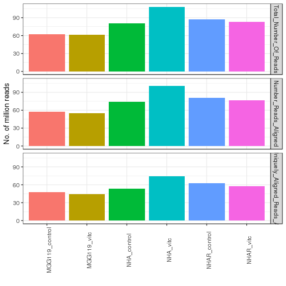<!-- -->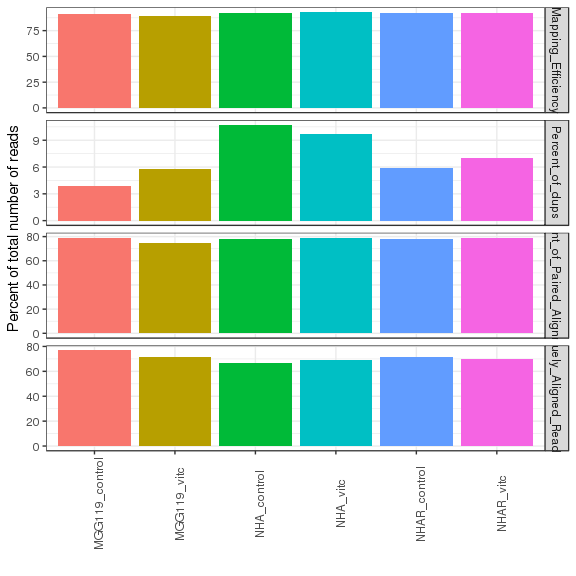<!-- -->

## Differential expression
* DEfine FDR = 0.01


### Intersect
* Significant intersect between mutant DN and VitC UP genes.   
* Significant intersect between MGG119 and NHAR.     

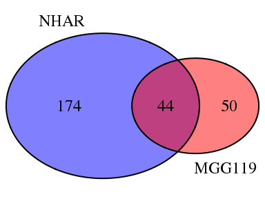<!-- -->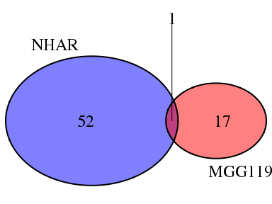<!-- -->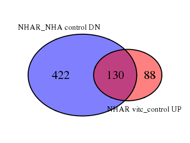<!-- -->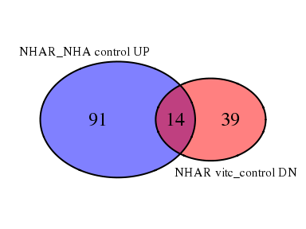<!-- -->

### DAVID functional enrichment


```
## [1] "No enrichment for UP.NHAR_control_NHA_control"
```

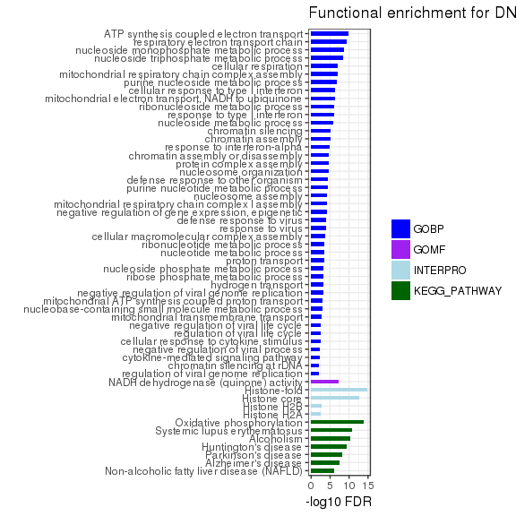<!-- -->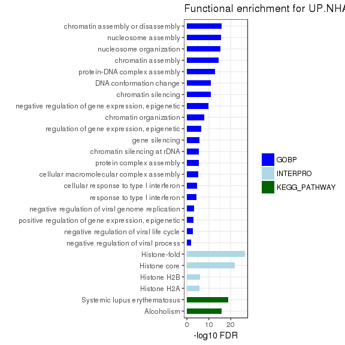<!-- -->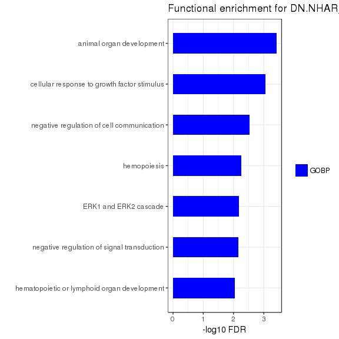<!-- -->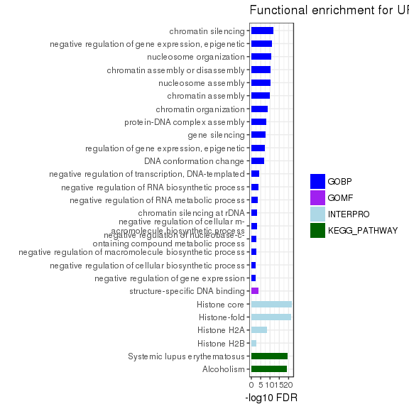<!-- -->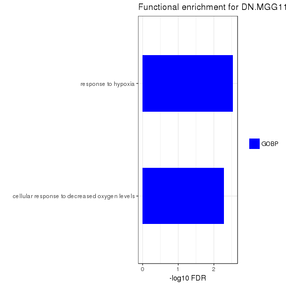<!-- -->

