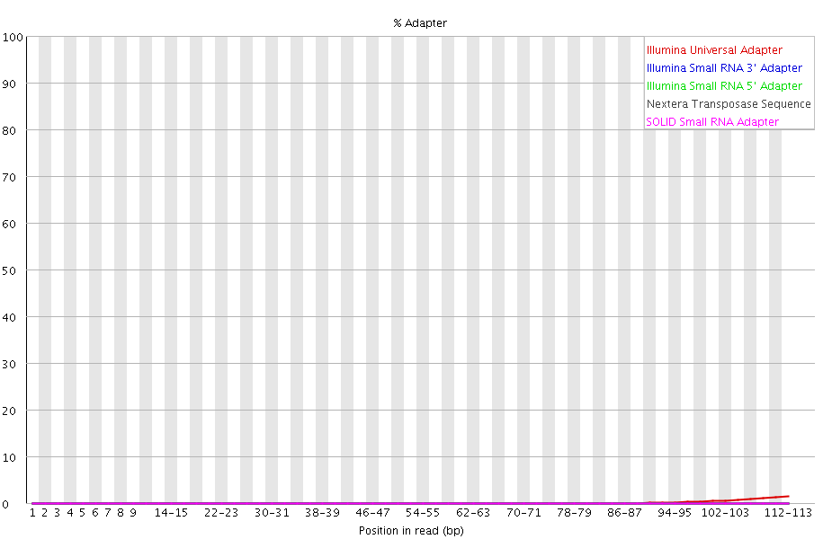
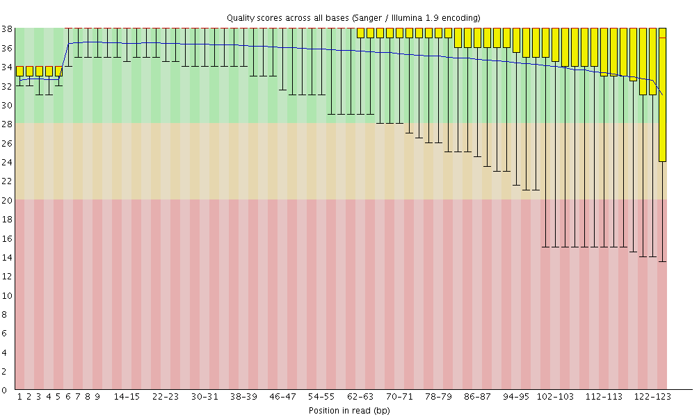

Updated: `r date()`

```{r setup, include = FALSE}
library(ggplot2)
library(plyr)
library(VennDiagram)
library(gridExtra)
library(gplots)
library(dendextend)
library(reshape)
library(wq)
library(dplyr)
library(RCircos)
library(knitr)
load("/projects/epigenomics3/epigenomics3_results/users/lli/NHA/hMeDIP/hMeDIP.Rdata")
knitr::opts_chunk$set(message=FALSE, echo = FALSE, warning = FALSE, results = FALSE, fig.height = 6, fig.width = 6) 
knitr::opts_knit$set(root.dir = "/projects/epigenomics3/epigenomics3_results/users/lli/NHA/hMeDIP/")
```

## QC 
* low mapping efficiency (40-60%).   
* trim and re-align: trim adapters and low quality end of the reads.        
* result: high mapping efficiency, but still low percent paired mapping.     

    
    

```{r QC}
(QC_summary_percent_figure)
(QC_summary_reads_figure)
```

## MACS2 ERs
* vitC treated have higher genome-wide coverage than control.     
* unique ER: non-overlapping peaks.     

```{r ER_summary}
(ER_summary_figure)
kable(ER_unique_summary, format = "html", align = "l", row.names = F)
```

### genomic breakdown
* unique ERs are enriched in enhancers.    

```{r genomic_breakdown}
(ER_unique_genomic_breakdown_figure)
```

### unique ER intersect

```{r venn}
grid.newpage()
grid.draw(NHAR_wt_vitc_venn)
grid.newpage()
grid.draw(NHAR_MGG_vitc_venn)
```

### homer

```{r homer}
(homer_unique_MGG119vitc_MGG119control_figure)
(homer_unique_NHARvitc_NHARcontrol_figure)
(homer_unique_NHAcontrol_NHARcontrol_figure)
```

