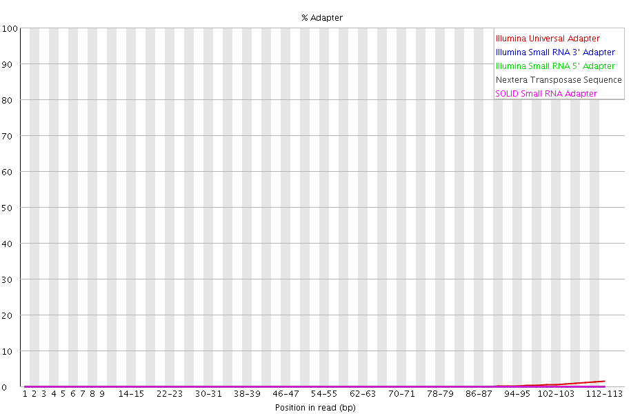

# VitC - hMeDIP
Gloria Li  
Jan 21, 2018  

Updated: Mon Jan 22 12:47:57 2018

## QC 
* low mapping efficiency (40-60%).   
* trim and re-align: trim adapters and low quality end of the reads.        
* result: high mapping efficiency, but still low percent paired mapping.     

    
    

<!-- --><!-- -->

## MACS2 ERs
* vitC treated have higher genome-wide coverage than control.     
* unique ER: non-overlapping peaks.     

<!-- --><table>
 <thead>
  <tr>
   <th style="text-align:left;"> Sample1 </th>
   <th style="text-align:left;"> Sample2 </th>
   <th style="text-align:left;"> unique </th>
   <th style="text-align:left;"> N_region </th>
   <th style="text-align:left;"> Total_length </th>
  </tr>
 </thead>
<tbody>
  <tr>
   <td style="text-align:left;"> MGG_vitc </td>
   <td style="text-align:left;"> MGG_control </td>
   <td style="text-align:left;"> MGG_vitc </td>
   <td style="text-align:left;"> 83224 </td>
   <td style="text-align:left;"> 27744273 </td>
  </tr>
  <tr>
   <td style="text-align:left;"> MGG_vitc </td>
   <td style="text-align:left;"> MGG_control </td>
   <td style="text-align:left;"> MGG_control </td>
   <td style="text-align:left;"> 35400 </td>
   <td style="text-align:left;"> 7487287 </td>
  </tr>
  <tr>
   <td style="text-align:left;"> NHAR_vitc </td>
   <td style="text-align:left;"> NHAR_control </td>
   <td style="text-align:left;"> NHAR_vitc </td>
   <td style="text-align:left;"> 35491 </td>
   <td style="text-align:left;"> 10552330 </td>
  </tr>
  <tr>
   <td style="text-align:left;"> NHAR_vitc </td>
   <td style="text-align:left;"> NHAR_control </td>
   <td style="text-align:left;"> NHAR_control </td>
   <td style="text-align:left;"> 33503 </td>
   <td style="text-align:left;"> 9841536 </td>
  </tr>
  <tr>
   <td style="text-align:left;"> NHA_vitc </td>
   <td style="text-align:left;"> NHA_control </td>
   <td style="text-align:left;"> NHA_vitc </td>
   <td style="text-align:left;"> 36597 </td>
   <td style="text-align:left;"> 11253011 </td>
  </tr>
  <tr>
   <td style="text-align:left;"> NHA_vitc </td>
   <td style="text-align:left;"> NHA_control </td>
   <td style="text-align:left;"> NHA_control </td>
   <td style="text-align:left;"> 33824 </td>
   <td style="text-align:left;"> 10207322 </td>
  </tr>
  <tr>
   <td style="text-align:left;"> NHAR_control </td>
   <td style="text-align:left;"> NHA_control </td>
   <td style="text-align:left;"> NHAR_control </td>
   <td style="text-align:left;"> 36597 </td>
   <td style="text-align:left;"> 11253011 </td>
  </tr>
  <tr>
   <td style="text-align:left;"> NHAR_control </td>
   <td style="text-align:left;"> NHA_control </td>
   <td style="text-align:left;"> NHA_control </td>
   <td style="text-align:left;"> 33824 </td>
   <td style="text-align:left;"> 10207322 </td>
  </tr>
</tbody>
</table>

### genomic breakdown
* unique ERs are enriched in enhancers.    

<!-- -->

### unique ER intersect

<!-- --><!-- -->

### homer

<!-- --><!-- --><!-- -->

