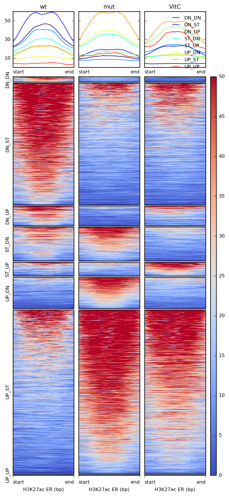

# VitC - wt-mut-vitC
Gloria Li  
Mar 4, 2018  

Updated: Mon Mar  5 10:55:43 2018

## PBAL and hMeDIP
* PBAL DMRs:      
	+ Methyl_diff p-value < 0.1        
	+ delta methylation > 0.25        
	+ hyper > 0.5       
	+ distance to adjacent DM CpG < 500bp        
	+ No. of CpGs >=3      
* hMeDIP DMRs:       
	+ calculate normalized signal for union of MACS2 ERs (q-value < 0.05)      
	+ Fold change of the signal > 2
	+ hyper signal > 5
* Combine PBAL with hMeDIP

<table>
 <thead>
  <tr>
   <th style="text-align:center;"> PBAL </th>
   <th style="text-align:center;"> hMeDIP </th>
   <th style="text-align:center;"> Cell1 </th>
   <th style="text-align:center;"> Cell2 </th>
  </tr>
 </thead>
<tbody>
  <tr>
   <td style="text-align:center;"> hyper </td>
   <td style="text-align:center;"> ST </td>
   <td style="text-align:center;"> C </td>
   <td style="text-align:center;"> mC </td>
  </tr>
  <tr>
   <td style="text-align:center;"> hyper </td>
   <td style="text-align:center;"> hyper </td>
   <td style="text-align:center;"> C </td>
   <td style="text-align:center;"> hmC </td>
  </tr>
  <tr>
   <td style="text-align:center;"> hyper </td>
   <td style="text-align:center;"> hypo </td>
   <td style="text-align:center;"> hmC </td>
   <td style="text-align:center;"> mC </td>
  </tr>
  <tr>
   <td style="text-align:center;"> hypo </td>
   <td style="text-align:center;"> ST </td>
   <td style="text-align:center;"> mC </td>
   <td style="text-align:center;"> C </td>
  </tr>
  <tr>
   <td style="text-align:center;"> hypo </td>
   <td style="text-align:center;"> hyper </td>
   <td style="text-align:center;"> mC </td>
   <td style="text-align:center;"> C(hmC) </td>
  </tr>
  <tr>
   <td style="text-align:center;"> hypo </td>
   <td style="text-align:center;"> hypo </td>
   <td style="text-align:center;"> hmC </td>
   <td style="text-align:center;"> C </td>
  </tr>
  <tr>
   <td style="text-align:center;"> ST </td>
   <td style="text-align:center;"> hyper </td>
   <td style="text-align:center;"> mC </td>
   <td style="text-align:center;"> hmC </td>
  </tr>
  <tr>
   <td style="text-align:center;"> ST </td>
   <td style="text-align:center;"> hypo </td>
   <td style="text-align:center;"> hmC </td>
   <td style="text-align:center;"> mC </td>
  </tr>
</tbody>
</table>

<table>
 <thead>
  <tr>
   <th style="text-align:center;"> Comparison </th>
   <th style="text-align:center;"> PBAL </th>
   <th style="text-align:center;"> hMeDIP </th>
   <th style="text-align:center;"> N_region </th>
   <th style="text-align:center;"> length </th>
  </tr>
 </thead>
<tbody>
  <tr>
   <td style="text-align:center;"> vitc-mut </td>
   <td style="text-align:center;"> hyper </td>
   <td style="text-align:center;"> hyper </td>
   <td style="text-align:center;"> 561 </td>
   <td style="text-align:center;"> 126412 </td>
  </tr>
  <tr>
   <td style="text-align:center;"> vitc-mut </td>
   <td style="text-align:center;"> hyper </td>
   <td style="text-align:center;"> hypo </td>
   <td style="text-align:center;"> 209 </td>
   <td style="text-align:center;"> 39231 </td>
  </tr>
  <tr>
   <td style="text-align:center;"> vitc-mut </td>
   <td style="text-align:center;"> hyper </td>
   <td style="text-align:center;"> ST </td>
   <td style="text-align:center;"> 9754 </td>
   <td style="text-align:center;"> 2841512 </td>
  </tr>
  <tr>
   <td style="text-align:center;"> vitc-mut </td>
   <td style="text-align:center;"> hypo </td>
   <td style="text-align:center;"> hyper </td>
   <td style="text-align:center;"> 646 </td>
   <td style="text-align:center;"> 149838 </td>
  </tr>
  <tr>
   <td style="text-align:center;"> vitc-mut </td>
   <td style="text-align:center;"> hypo </td>
   <td style="text-align:center;"> hypo </td>
   <td style="text-align:center;"> 273 </td>
   <td style="text-align:center;"> 64969 </td>
  </tr>
  <tr>
   <td style="text-align:center;"> vitc-mut </td>
   <td style="text-align:center;"> hypo </td>
   <td style="text-align:center;"> ST </td>
   <td style="text-align:center;"> 7526 </td>
   <td style="text-align:center;"> 2066921 </td>
  </tr>
  <tr>
   <td style="text-align:center;"> vitc-mut </td>
   <td style="text-align:center;"> ST </td>
   <td style="text-align:center;"> hyper </td>
   <td style="text-align:center;"> 225822 </td>
   <td style="text-align:center;"> 451644 </td>
  </tr>
  <tr>
   <td style="text-align:center;"> vitc-mut </td>
   <td style="text-align:center;"> ST </td>
   <td style="text-align:center;"> hypo </td>
   <td style="text-align:center;"> 534045 </td>
   <td style="text-align:center;"> 1068090 </td>
  </tr>
  <tr>
   <td style="text-align:center;"> wt-mut </td>
   <td style="text-align:center;"> hyper </td>
   <td style="text-align:center;"> hyper </td>
   <td style="text-align:center;"> 633 </td>
   <td style="text-align:center;"> 151174 </td>
  </tr>
  <tr>
   <td style="text-align:center;"> wt-mut </td>
   <td style="text-align:center;"> hyper </td>
   <td style="text-align:center;"> hypo </td>
   <td style="text-align:center;"> 2201 </td>
   <td style="text-align:center;"> 566184 </td>
  </tr>
  <tr>
   <td style="text-align:center;"> wt-mut </td>
   <td style="text-align:center;"> hyper </td>
   <td style="text-align:center;"> ST </td>
   <td style="text-align:center;"> 22967 </td>
   <td style="text-align:center;"> 7821373 </td>
  </tr>
  <tr>
   <td style="text-align:center;"> wt-mut </td>
   <td style="text-align:center;"> hypo </td>
   <td style="text-align:center;"> hyper </td>
   <td style="text-align:center;"> 623 </td>
   <td style="text-align:center;"> 163398 </td>
  </tr>
  <tr>
   <td style="text-align:center;"> wt-mut </td>
   <td style="text-align:center;"> hypo </td>
   <td style="text-align:center;"> hypo </td>
   <td style="text-align:center;"> 1518 </td>
   <td style="text-align:center;"> 419388 </td>
  </tr>
  <tr>
   <td style="text-align:center;"> wt-mut </td>
   <td style="text-align:center;"> hypo </td>
   <td style="text-align:center;"> ST </td>
   <td style="text-align:center;"> 23408 </td>
   <td style="text-align:center;"> 9393986 </td>
  </tr>
  <tr>
   <td style="text-align:center;"> wt-mut </td>
   <td style="text-align:center;"> ST </td>
   <td style="text-align:center;"> hyper </td>
   <td style="text-align:center;"> 228121 </td>
   <td style="text-align:center;"> 456242 </td>
  </tr>
  <tr>
   <td style="text-align:center;"> wt-mut </td>
   <td style="text-align:center;"> ST </td>
   <td style="text-align:center;"> hypo </td>
   <td style="text-align:center;"> 506180 </td>
   <td style="text-align:center;"> 1012360 </td>
  </tr>
</tbody>
</table>

## H3K27ac 
	+ calculate normalized signal for union of FindER ERs    
	+ Fold change of the signal > 2
	+ hyper signal > 5

<table>
 <thead>
  <tr>
   <th style="text-align:center;"> Comparison </th>
   <th style="text-align:center;"> H3K27ac </th>
   <th style="text-align:center;"> N_region </th>
   <th style="text-align:center;"> length </th>
  </tr>
 </thead>
<tbody>
  <tr>
   <td style="text-align:center;"> wt-mut-vitc </td>
   <td style="text-align:center;"> DN_DN </td>
   <td style="text-align:center;"> 197 </td>
   <td style="text-align:center;"> 92700 </td>
  </tr>
  <tr>
   <td style="text-align:center;"> wt-mut-vitc </td>
   <td style="text-align:center;"> DN_ST </td>
   <td style="text-align:center;"> 4353 </td>
   <td style="text-align:center;"> 3697306 </td>
  </tr>
  <tr>
   <td style="text-align:center;"> wt-mut-vitc </td>
   <td style="text-align:center;"> DN_UP </td>
   <td style="text-align:center;"> 713 </td>
   <td style="text-align:center;"> 331521 </td>
  </tr>
  <tr>
   <td style="text-align:center;"> wt-mut-vitc </td>
   <td style="text-align:center;"> ST_DN </td>
   <td style="text-align:center;"> 1217 </td>
   <td style="text-align:center;"> 542118 </td>
  </tr>
  <tr>
   <td style="text-align:center;"> wt-mut-vitc </td>
   <td style="text-align:center;"> ST_UP </td>
   <td style="text-align:center;"> 503 </td>
   <td style="text-align:center;"> 224775 </td>
  </tr>
  <tr>
   <td style="text-align:center;"> wt-mut-vitc </td>
   <td style="text-align:center;"> UP_DN </td>
   <td style="text-align:center;"> 1122 </td>
   <td style="text-align:center;"> 481736 </td>
  </tr>
  <tr>
   <td style="text-align:center;"> wt-mut-vitc </td>
   <td style="text-align:center;"> UP_ST </td>
   <td style="text-align:center;"> 5856 </td>
   <td style="text-align:center;"> 5627267 </td>
  </tr>
  <tr>
   <td style="text-align:center;"> wt-mut-vitc </td>
   <td style="text-align:center;"> UP_UP </td>
   <td style="text-align:center;"> 28 </td>
   <td style="text-align:center;"> 12387 </td>
  </tr>
</tbody>
</table>

